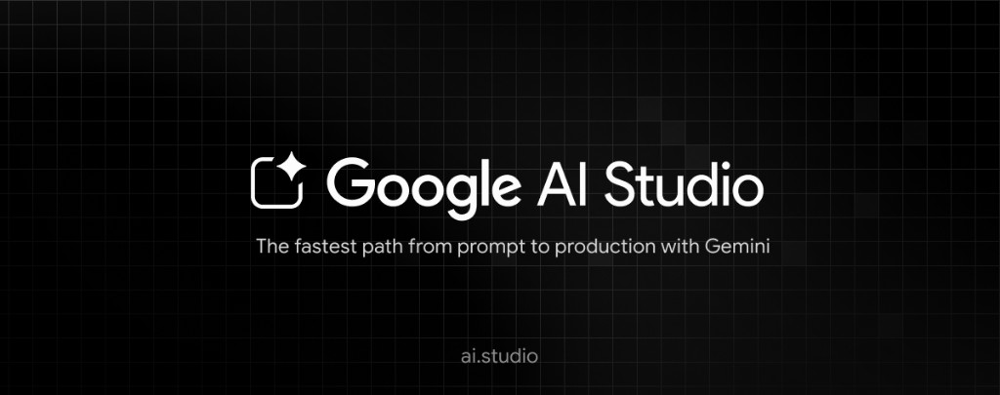

<div align="center">

# 🧭 AI Career Coaching Navigator · AI 求职智航 Pro
### *Ship a JD-aligned story without sounding like a generic template.*
### *把项目经历挖清楚，再把简历和面试叙事对齐到这张 JD。*


<br />



<sub><a href="https://aistudio.google.com/">Google AI Studio</a> · ai.studio</sub>

</div>

---

## Run and deploy your AI Studio app

This contains everything you need to run your app locally.

View your app in AI Studio: https://ai.studio/apps/drive/1f3Gr50jDFW44WjUBozfvHWdVsKCNow6-

---

<div align="center">

**[English](#english) · [中文](#chinese)**

</div>

---

<a name="english"></a>

## What is this?

**AI Career Coaching Navigator** is a Gemini-powered React app for technical job seekers: **voice-first project discovery**, **JD ingestion**, **STAR-style resume synthesis**, and **mock interviews** that reference your own assets—not canned STAR paragraphs scraped from Medium.

Born from the [Google AI Studio](https://aistudio.google.com/) app template; this repo is the code you run locally while iterating prompts and UX.

## 🎯 When to use it

- You have real projects but struggle to **map them to a specific JD**
- You want **structured storytelling** (challenge → action → metric) without hiring a résumé farm
- You’re prepping interviews and need **feedback loops**, not one-shot bullet lists

## ✨ Features

- 🎙️ **Discovery / 项目挖掘** — capture projects as structured assets (background, tasks, results, stack)
- 📄 **JD parsing** — store roles, keywords, requirements; switch JDs without losing context
- ✍️ **Resume generation** — align bullets to the selected JD with scoring cues
- 💬 **Mock interview** — Q&A with gap analysis tied back to your assets
- 🔐 **Local-first dev** — Gemini key via `.env.local`; no secret committed

## 🛠️ Tech Stack

```
UI:          React 19 · TypeScript · Vite 6
AI:          Google Gemini (@google/genai)
Config:      GEMINI_API_KEY via Vite env → process.env.API_KEY
Permissions: microphone / camera requested by shell metadata for voice-first flows
```

## 🚀 Quick Start

**Prerequisites:** Node.js 18+

```bash
git clone https://github.com/Timelovers/AI-Career-Coaching-Navigator-.git
cd AI-Career-Coaching-Navigator-
npm install
```

Create `.env.local` in the repo root:

```bash
GEMINI_API_KEY=your-google-genai-key
```

Run:

```bash
npm run dev
```

Dev server listens on **port 3000** (`host: 0.0.0.0`).

## 📬 Contact

- GitHub: [@Timelovers](https://github.com/Timelovers)
- Website: [lijiaxing.com.cn](https://lijiaxing.com.cn/)

---

<a name="chinese"></a>

## 这是什么？

**AI 求职智航 Pro**：面向技术岗求职者的一体化助手——**语音/文本挖掘项目经历**、**解析 JD**、**生成更贴 JD 的简历叙事**，再做带反馈的**模拟面试**。底层调用 **Google Gemini**，界面与步骤流在 `App.tsx` 里拆成「项目挖掘 → JD → 简历 → 模拟面试」四段。

仓库源自 **Google AI Studio** 应用模板；上面的 **AI Studio 入口链接**保留，方便你在云端原型与本地代码之间切换。

## 🎯 什么时候用

- 有真实项目，但不知道怎么**对齐到具体 JD**
- 想把经历写成**可追问、可量化**的叙事，而不是堆关键词
- 需要多轮**模拟面试与缺口提示**，而不是一次性生成一堆空话

## ✨ 功能亮点

- 🎙️ **项目挖掘** — 把经历沉淀成结构化素材（背景 / 任务 / 行动 / 结果 / 栈）
- 📄 **JD 管理** — 关键词与要求拆解，多 JD 切换不丢上下文
- ✍️ **简历生成** — 面向所选 JD 输出项目条目与匹配度提示
- 💬 **模拟面试** — 问答 + 缺口分析，尽量锚回你的素材库
- 🔐 **本地开发友好** — `GEMINI_API_KEY` 放 `.env.local`，不进仓库

## 🛠️ 技术栈

```
前端：      React 19 · TypeScript · Vite 6
模型：      Google Gemini（@google/genai）
密钥：      `.env.local` 中 GEMINI_API_KEY，由 Vite 注入
```

## 🚀 快速开始

环境：**Node.js 18+**

```bash
git clone https://github.com/Timelovers/AI-Career-Coaching-Navigator-.git
cd AI-Career-Coaching-Navigator-
npm install
```

在项目根目录新建 `.env.local`：

```bash
GEMINI_API_KEY=你的谷歌GenAI密钥
```

启动：

```bash
npm run dev
```

默认开发端口：**3000**。

## 📬 联系方式

- GitHub：[@Timelovers](https://github.com/Timelovers)
- 主页：[lijiaxing.com.cn](https://lijiaxing.com.cn/)

---

> 「简历不是形容词堆砌，是证据链。」
>
> *A résumé isn't adjectives—it's a chain of evidence.*

---

<div align="center">

Made with 💜 by [Sara](https://lijiaxing.com.cn/) · [@Timelovers](https://github.com/Timelovers)

</div>
